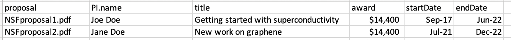

# NSF-PendingSupport

R script to search all full NSF proposals in PDF format (pattern: "NSF.*.pdf") in a folder, then extract and tabulize NSF current and pending support into a CSV file for easy viewing.

## Installation

Configure path and run; if errors occur, then skip PDF file or modify. Output is saved in `output.csv`, which has the following structure:

